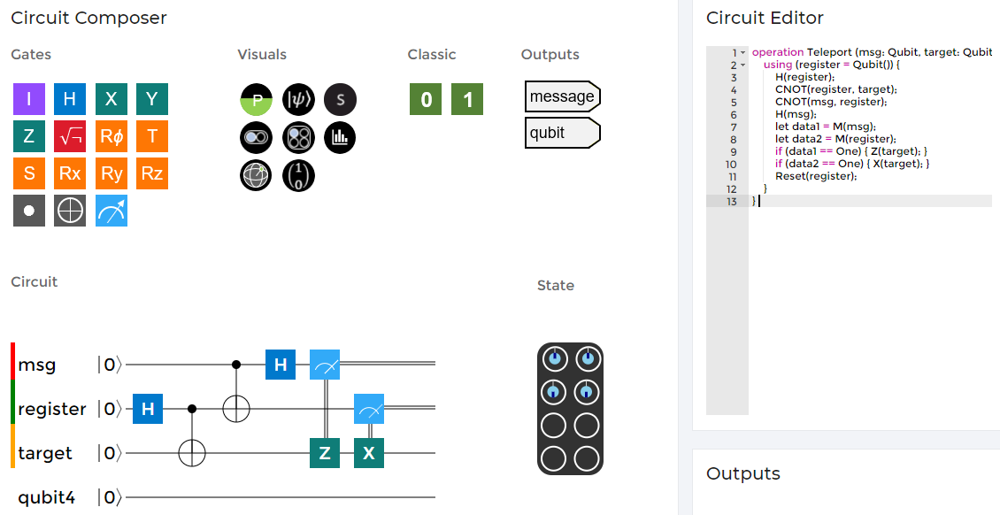

# Bono

Bono is a quantum circuit visualizer that allows you to edit quantum circuits and evaluate them at real-time. It also generates [Q#](https://docs.microsoft.com/en-us/quantum/language/?view=qsharp-preview) code that you can take and run on [Microsoft Quantum Development Kit](https://www.microsoft.com/en-us/quantum/development-kit) and in the future, a real quantum computer.

Bono provides the following features:

* Pure JavaScript-based. Run offline without a web server.
* Drag-and-drop circuit editor with real-time evaluation.
* Dynamic debugging. Examine any stages of the circuit at any time. 
* Automatically generates Q# code.
* Switch among a rich set of state visualizations. 
* Completely open source. 

# Getting Started

1. Clone this repository.
2. Open html\index.html with your browser.
3. Edit away!

# Contributing

This project welcomes contributions and suggestions.  Most contributions require you to agree to a
Contributor License Agreement (CLA) declaring that you have the right to, and actually do, grant us
the rights to use your contribution. For details, visit https://cla.opensource.microsoft.com.

When you submit a pull request, a CLA bot will automatically determine whether you need to provide
a CLA and decorate the PR appropriately (e.g., status check, comment). Simply follow the instructions
provided by the bot. You will only need to do this once across all repos using our CLA.

This project has adopted the [Microsoft Open Source Code of Conduct](https://opensource.microsoft.com/codeofconduct/).
For more information see the [Code of Conduct FAQ](https://opensource.microsoft.com/codeofconduct/faq/) or
contact [opencode@microsoft.com](mailto:opencode@microsoft.com) with any additional questions or comments.
